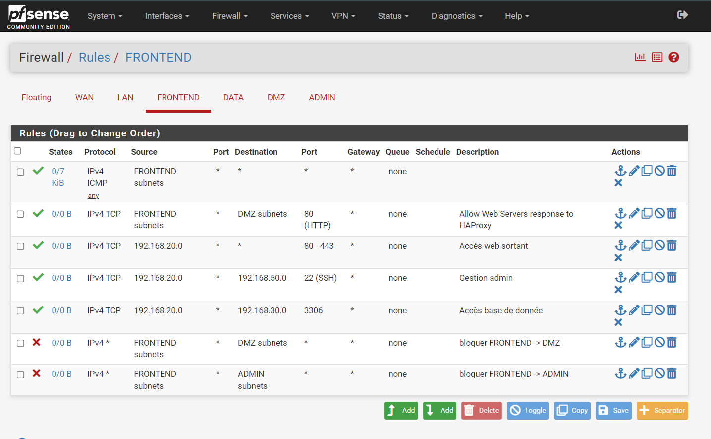
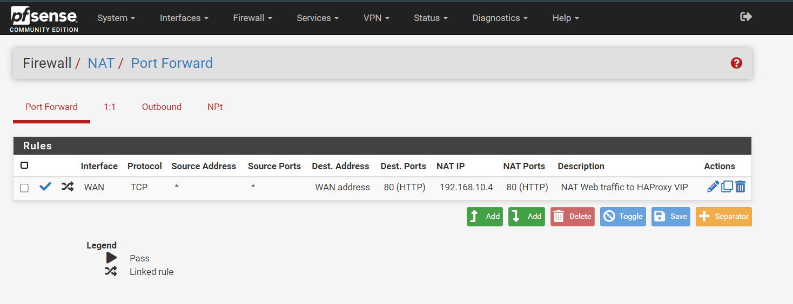
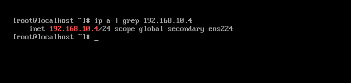

# Sécurisation d’infrastructure Web & BDD – Défense en profondeur

> Projet de sécurisation d’une infrastructure web + base de données avec segmentation réseau, pfSense, HAProxy, haute disponibilité, hardening AlmaLinux et défense en profondeur.

---

## Table des matières

1. [Contexte & objectifs](#-contexte--objectifs)
2. [Outils utilisés](#-outils-utilisés)
3. [Architecture réseau](#-architecture-réseau)
4. [Règles firewall](#-règles-firewall--deny-by-default)
5. [NAT & exposition](#-nat--exposition-contrôlée)
6. [Haute disponibilité](#-haute-disponibilité--vip-keepalived)
7. [Hardening des systèmes](#-hardening--services-actifs)
8. [Base de données](#-base-de-données)
9. [Tests de sécurité](#-tests-de-sécurité)
10. [Commandes clés](#-commandes-clés)
11. [Contenu du dépôt](#-contenu-du-dépôt)
12. [Équipe](#-équipe)

---

##  Contexte & objectifs

| Objectif | Description |
|----------|-------------|
| Segmentation réseau | 4 réseaux distincts : DMZ, FRONTEND, DATA, ADMIN |
| Deny by default | pfSense comme point central, règles explicites |
| Haute disponibilité | 2 HAProxy + VIP Keepalived |
| Hardening | AlmaLinux, CIS Level 1, services minimaux |
| Isolation BDD | Base de données accessible uniquement depuis FRONTEND |

---

## Outils utilisés

| Outil | Rôle |
|-------|------|
| **pfSense** | Firewall, routage inter-réseaux, NAT |
| **HAProxy** | Load balancing (répartition du trafic web) |
| **Keepalived** | VIP (bascule automatique HAProxy) |
| **AlmaLinux 9** | Système d’exploitation des serveurs |
| **Apache / PHP-FPM** | Serveur web + application PHP |
| **MariaDB** | Base de données |
| **CIS Benchmark** | Hardening des systèmes |

---

## Architecture réseau

### Interfaces pfSense

| Interface | Zone | Rôle | IP réseau |
|-----------|------|------|-----------|
| em0 | WAN | Accès Internet | DHCP |
| em1 | LAN | Réseau local | 192.168.1.0/24 |
| em2 | FRONTEND | Serveurs web | 192.168.10.0/24 |
| em3 | DATA | Base de données | 192.168.30.0/24 |
| em4 | DMZ | HAProxy | 192.168.20.0/24 |
| em5 | ADMIN | Administration | 192.168.40.0/24 |

### Matrice des flux autorisés

| Source | Destination | Port | Protocole |
|--------|-------------|------|-----------|
| Internet | VIP HAProxy | 80 | HTTP |
| HAProxy | Serveurs web | 80 | HTTP |
| Serveurs web | BDD | 3306 | MySQL |
| Admin | Tous serveurs | 22 | SSH |

---

## Règles firewall – Deny by default

### Zone FRONTEND (serveurs web)

### Zone DMZ (HAProxy)

> Principe : **Tout est bloqué sauf ce qui est explicitement autorisé**

---

## NAT – Exposition contrôlée

| Interface | Protocole | Port source | Destination | NAT IP | Port destination |
|-----------|-----------|-------------|-------------|--------|------------------|
| WAN | TCP | * | WAN address:80 | 192.168.10.4 | 80 (HAProxy VIP) |

**Seule la VIP HAProxy est exposée** – aucune autre machine n’est accessible depuis l’extérieur.

---

## Haute disponibilité – VIP Keepalived

`
ip a | grep 192.168.10.4
`
# Résultat : inet 192.168.10.4/24 scope global secondary ens224

| Nœud     | Rôle      | IP            | 
|----------|-----------|---------------|
| HAProxy1 | Master    | 192.168.20.20 | 
| HAProxy2 | Backup    | 192.168.20.21 | 
| VIP      | Virtuelle | 192.168.10.4  | 

Bascule automatique : si HAProxy1 tombe, la VIP bascule sur HAProxy2

Hardening – Services actifs
https://screenshots/06-services-actifs-web.png

Services uniquement nécessaires sur le serveur web :

Service	Rôle
httpd	Serveur Apache
php-fpm	PHP FastCGI
sshd	Administration sécurisée
mariadb	Base de données (sur DATA uniquement)
firewalld	Pare-feu local
Tous les autres services sont désactivés (CIS Level 1)

Base de données
Écoute réseau MySQL
https://screenshots/07-mysql-ecoute.png

`bash
ss -tuln | grep 3306 
`
# Résultat : tcp LISTEN 0.0.0.0:3306
Permissions MySQL (moindre privilège)
https://screenshots/10-permissions-mysql.png

sql
SELECT host, user FROM mysql.user WHERE user = 'efrei_user';
host	user
192.168.10.%	efrei_user
192.168.10.10	efrei_user
192.168.10.11	efrei_user
L’utilisateur ne peut se connecter que depuis le réseau FRONTEND

Service MariaDB actif
https://screenshots/11-mariadb-status.png

bash
systemctl status mariadb
# Résultat : active (running)
Tests de sécurité
Test 1 : Accès BDD depuis DMZ → Échec
https://screenshots/08-acces-bdd-timeout.png

`bash
curl -v telnet://192.168.30.10:3306
`
# Résultat : Connection timed out
La base de données est inaccessible depuis la DMZ

Test 2 : SSH depuis mauvais réseau → Échec
https://screenshots/09-ssh-blocked.png

`bash
ssh root@192.168.40.10
`
# Résultat : Connection timed out
Le réseau ADMIN est isolé – aucun accès SSH depuis les autres zones

Commandes clés
Installation des services web

# Installation Apache + PHP
`yum install httpd php php-fpm php-cli -y `

# Activation des services
`systemctl enable --now httpd php-fpm `

# Configuration firewall
`firewall-cmd --add-service=http --permanent
firewall-cmd --reload
Installation MariaDB `

# Installation
`yum install mariadb mariadb-server -y `

# Sécurisation
`mysql_secure_installation `

# Activation
`systemctl enable --now mariadb `
Création base de données
sql
`CREATE DATABASE efrei_projet;
CREATE USER 'efrei_user'@'192.168.10.%' IDENTIFIED BY 'Adm3Pl2!';
GRANT SELECT, INSERT, UPDATE, DELETE ON efrei_projet.* TO 'efrei_user'@'192.168.10.%';
FLUSH PRIVILEGES; `

Vérifications
# Voir les services actifs
`systemctl list-units --type=service --state=running`

# Voir les ports ouverts
`ss -tuln`

# Tester la connectivité
`curl -v telnet://IP:PORT`

# Équipe
Sherine EDEL	     
Syrine ABDELBASSET	
Lina FASSI	
Mounia DJA DAOUADJI	

# Conclusion
Objectif	Statut
Segmentation réseau (4 zones)	
Deny by default	
HAProxy + Keepalived (VIP)	
Hardening AlmaLinux (CIS Level 1)	
Isolation BDD	
Tests de sécurité validés	
